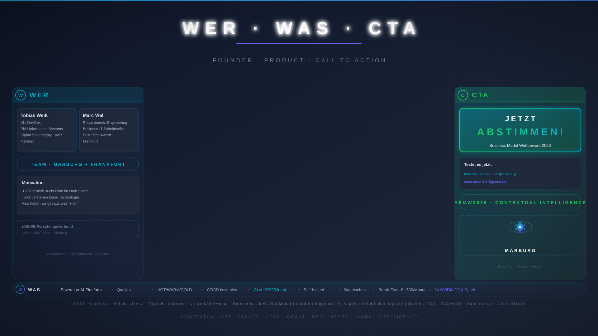

# 30-Sekunden-Pitch — Wer / Was / CTA

> **Dauer:** 30 Sekunden
> **Format:** Greenscreen, ein Sprecher (Marc)
> **Stil:** Emotional, direkt, positiv — Herausforderung, nicht Problem
> **Hintergrund:** `png/bg-07-wer-was-cta.png` (ein Hintergrund)
> **Sprecher:** Marc

---

## Technische Produktionshinweise

- Wie Hauptpitch: gleiche Kameraposition, gleiches Audio
- **Kein Background-Wechsel** — Marc zeigt auf linke (WER), mittlere + rechte Spalte (WAS + CTA)
- **Kein Sprecherwechsel** — Marc durchgehend
- **Untertitel:**

---

## SKRIPT

---

### FRAGEN & EINSTIEG (0:00–0:15) → **Marc**

„Du arbeitest im MedTech Bereich?
Dir ist Klarheit, Übersichtlichkeit und Zuversichtlichkeit in deinem Job wichtig?
Du möchtest gute Leads gewinnen?
Dann haben wir die passende Lösung für dich!"

---

### LÖSUNG & CTA (0:15–0:30) → **Marc**

„Wir verarbeiten die Signale, die der Markt und das regulatorische Umfeld sendet. Wir haben ein Tool entwickelt, um Signale wie Patente, Zulassungen und Publikationen zu erkennen, diese zu bewerten und dadurch mögliche Leads zu identifizieren. Du möchtest von künstlicher Intelligenz profitieren? Dann vereinbare jetzt deinen kostenlosen Demo Termin, um zu sehen, welche aktuellen Leads auf dich warten."

Cut-Anweiseung: Cut nach "Und gib uns deine Stimme." (Teil mit Uservoting hinten raus weg lassen, sowohl das Wort im Video als auch den Outtake)
