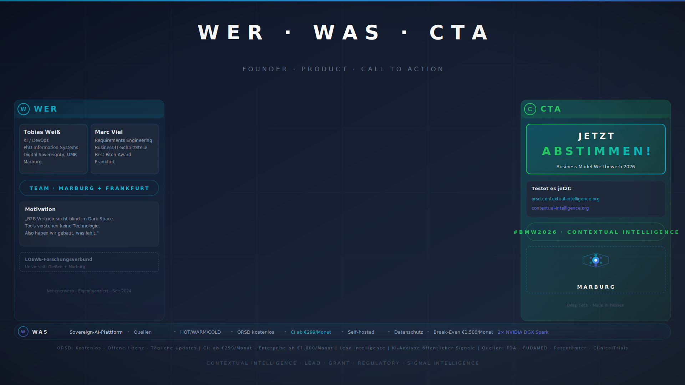

# 30-Sekunden-Pitch — Wer / Was / CTA

> **Dauer:** 30 Sekunden
> **Format:** Greenscreen, zwei Sprecher im Wechsel
> **Stil:** Emotional, direkt, geschichtengetrieben — optimiert für Jury und breites Publikum
> **Hintergrund:** `svg/bg-07-wer-was-cta.svg` — Ein Hintergrund für das gesamte Video (kein Wechsel)
> **Verwendung:** Elevator Pitch / Social-Media-Teaser / Intro-Video für die Website
> **Sprecher:** Marc (Problem) + Tobias (Lösung & CTA) — je ~15s

---

## Technische Produktionshinweise (TI)

### Greenscreen-Setup
- Wie Hauptpitch: Kamera zentral, beide Sprecher auf Augenhöhe, mittig
- **Zwei Mikrofone** (Lavalier) — gleicher Pegel
- **Kein Background-Wechsel** — Overlays (WER → WAS → CTA) setzen Akzente
- Marc zeigt auf linke Spalte (WER), Tobias auf Mitte + rechte Spalte (WAS + CTA)

### Schnitt-Empfehlung
- **Hart-Schnitt beim Sprecherwechsel** (bei 0:15)
- Untertitel (eingebrannt): 3 Zeilen, synchron zum Sprecher
  - Zeile 1 — Section-Header: **MARC:** / **TOBIAS:** (fett, cyan)
  - Zeilen 2–3 — Sprechertext

### Audio
- Gleiche Einstellung wie Hauptpitch — gleiche Kette für beide Stimmen
- Tempo: Etwas schneller als der 3-Min-Pitch — 30s sind knapp

---

## SKRIPT — 30 Sekunden

**Timer: 0:00–30s**

> *[Background zeigt dreigeteiltes Layout: links WER, mitte WAS, rechts CTA. Marc startet.]*

---

### AKT 1 — PROBLEM (0:00–0:15) → **Marc**

> *[Marc zeigt auf linke Spalte]*

**(0:00–0:15)**
„Rund 40.000 Medizinprodukte müssen bis 2027 neu zertifiziert werden. Jeder sucht Partner — aber LinkedIn findet nur Firmen, nicht Technologie. Ein Startup kurz vor der Pleite — weil sie die falschen Kunden suchten."

*—— Hart-Schnitt zu Tobias ——*

---

### AKT 2 — LÖSUNG & CTA (0:15–0:30) → **Tobias**

> *[Tobias zeigt auf mittlere, dann rechte Spalte — energisch]*

**(0:15–0:30)**
„Wir haben gebaut, was fehlt: Echtzeit-Datenquellen, Wissensgraph, KI-Scoring — auf eigener Hardware, DSGVO-konform. 299 Euro im Monat, um ein Vielfaches günstiger als Citeline. Selbstfinanziert. Testen Sie es auf contextual-intelligence.org. Danke."

---

> **Ende.** Ziel-Gesamtlänge: ~28–30 Sekunden.
