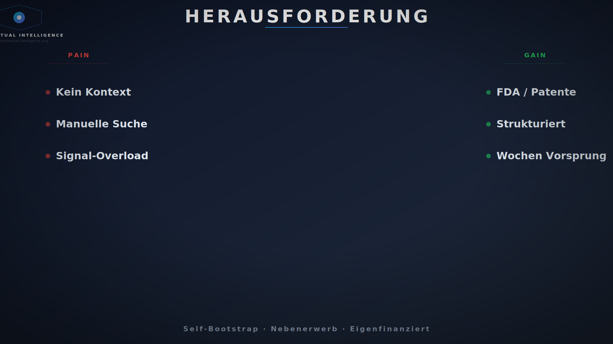
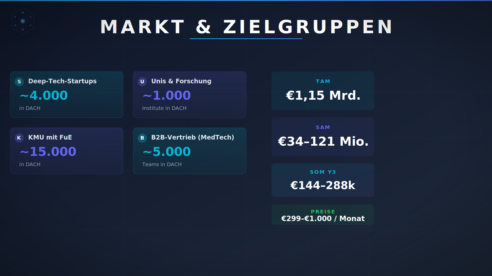
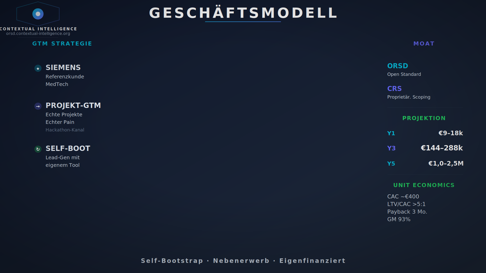
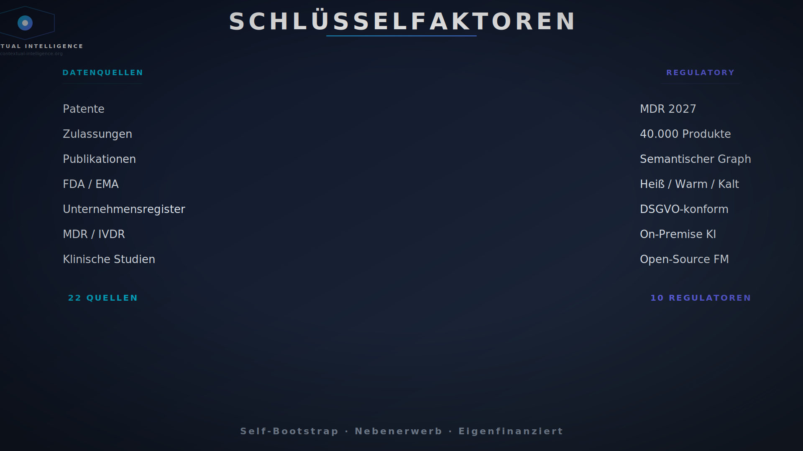
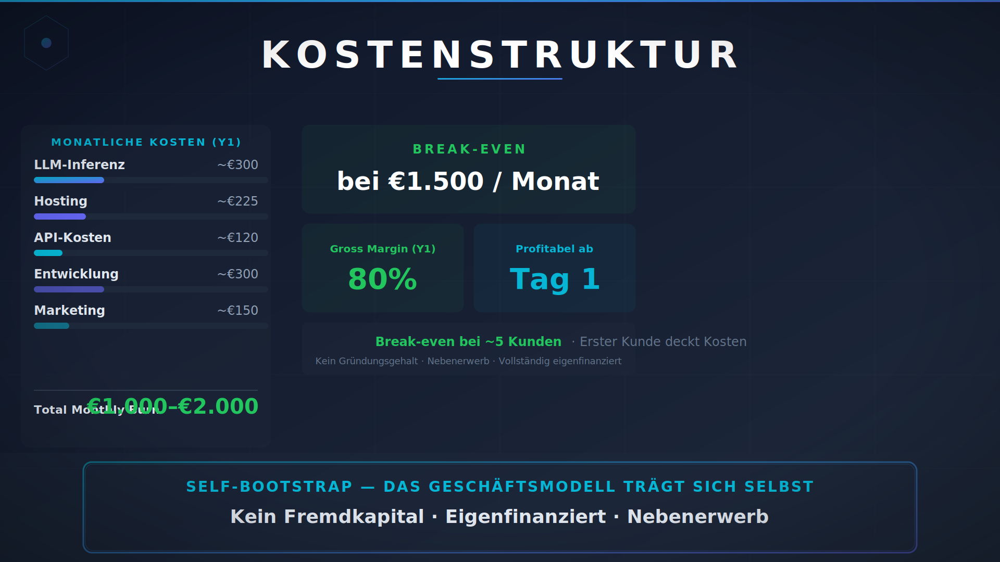
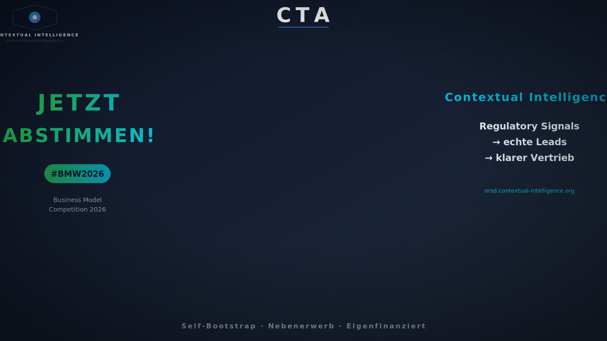

# Pitch-Skript + TI — Business Model Wettbewerb 2026

> **Dauer:** 3 Minuten (180 Sekunden)
> **Format:** Greenscreen, zwei Sprecher im Wechsel
> **Stil:** Emotional, bildhaft, geschichtengetrieben — optimiert für Jury-Kriterien (Problemvalidierung, Team, gesellschaftliche Relevanz, tragfähiges Geschäftsmodell)
> **Hintergründe:** `svg/bg-01-problem.svg` bis `svg/bg-06-cta.svg`
> **Sprecher:** Tobias (Technik) + Marc (Business) — ca. 50/50 Redeanteil

---

## Technische Produktionshinweise (TI)

### Greenscreen-Setup
- **Kamera:** Zentrale Position, auf Augenhöhe
- **Sprecher:** Jeweils mittig im Bild, ca. 1/3 der Bildhöhe. Bei Wechsel: gleiche Position, gleiche Beleuchtung
- **Zwei Mikrofone** (Lavalier für beide) — gleicher Pegel, gleicher Kompressor
- **Greenscreen:** gleichmäßig ausgeleuchtet, kein Schatten auf dem Hintergrund
- **Keying:** Chroma-Key mit weicher Kante (0.5–1px), kein hartes Ausblenden

### Background-Wechsel + Sprecher (6 Szenen)

| Szene | Zeit | Sprecher | SVG | Keying-Hinweis |
|-------|------|----------|-----|-----------------|
| 1 Problem | 0:00–0:28 | **Tobias** | `bg-01-problem.svg` | Pain links / Gain rechts · Lösung unten |
| 2 Team/Markt | 0:28–1:00 | **Marc** | `bg-02-markt.svg` | Segmente links/rechts · Marktzahlen unten |
| 3 Revenue | 1:00–1:24 | **Marc** | `bg-03-revenue.svg` | Preise links · Vorteil rechts · Prognose unten |
| 4 Schlüssel | 1:24–1:54 | **Tobias** | `bg-04-schluesselfaktoren.svg` | Resources+Partners links · Activities rechts |
| 5 Kosten | 1:54–2:17 | **Tobias** | `bg-05-kosten.svg` | Kosten links · Break-Even rechts · Vorteil unten |
| 6 CTA | 2:17–2:37 | **Marc** | `bg-06-cta.svg` | Voting links · Produkte rechts · Logo unten |
| Puffer | 2:37–3:00 | — | — | Atem holen, Blick in Kamera |

### Kamera & Schnitt
- **Schnitt:** Hart-Schnitt zwischen Szenen (kein Crossfade — wirkt professioneller)
- **Sprecher-Beleuchtung:** Key-Light von schräg oben (30°), Fill von der anderen Seite — **identisch für beide Sprecher**
- **Kleidung:** Kein Grün, kein feines Streifenmuster (Moiré) — **beide**
- **Blick:** Fest in die Kamera, gelegentlich Blick zu Fakten (wie auf Bühne)

### Audio
- **Mikrofon:** 2× Ansteckmikrofon (Lavalier) — gleicher Typ, gleicher Abstand
- **Raumton:** Kein Hall, ruhiger Raum
- **Pegel:** -12dB bis -6dB Spitze, kein Clipping
- **Post:** Leichter Kompressor (Ratio 3:1), Noise Gate, De-Esser — **gleiche Kette für beide Stimmen**

### Untertitel
- Eingebrannte Untertitel (immer sichtbar) — 85% schauen ohne Ton
- Schrift: Weiß mit schwarzem Schatten (1px), Sans-Serif, 32pt
- Timing: synchron zum Sprecher, max. 2 Zeilen
- **Sprecher-Wechsel im Untertitel:** Namen vor dem Text, z.B. "**Tobias:** ..." / "**Marc:** ..."

---

# SKRIPT

---

## SZENE 1 — PROBLEM (0:00–0:28) → Sprecher: **Tobias** · `bg-01-problem.svg`

**Timer: 0:00 – 28 Sekunden**

> *[Tobias zentral, blickt in Kamera. Background zeigt Pains links, Gains rechts im Graph-Layout.]*

**(0:00–0:06) Hook:**
„Wir kennen ein Startup mit bahnbrechender Technologie — kurz vor der Pleite. Nicht wegen des Produkts. Sondern weil sie die falschen Kunden suchten."

**(0:06–0:14) Pain:**
*pause*
„Die meisten MedTech-Gründungen scheitern nicht am Produkt — sondern am Vertrieb. LinkedIn kennt nur Firmen, nicht Technologie. Es zeigt nicht, wer zertifiziert, klinische Studien startet oder ein neues Produkt anmeldet — genau das wären die richtigen Signale."

**(0:14–0:20) Warum jetzt:**
„Mai 2027: rund 40.000 Medizinprodukte neu zertifiziert. Wer die richtigen Partner zuerst findet, gewinnt Jahre."

**(0:20–0:28) Lösung:**
*pause*
„Wir haben mit 20 Vertriebsleitern gesprochen. Die Antwort: Contextual Intelligence — 22 Datenquellen, semantischer Graph, Signale heiß, warm, kalt. Auf eigener Hardware, datenschutzkonform, nie älter als 24 Stunden. Pilot läuft mit Siemens Healthineers."

---

## SZENE 2 — TEAM & MARKT (0:28–1:00) → Sprecher: **Marc** · `bg-02-markt.svg`

**Timer: 0:28 – 32 Sekunden**

> *[Marc jetzt im Bild (gleiche Position). Background zeigt Zielgruppen-Segmente als Cards + Marktzahlen.]*

**(0:28–0:38) Team:**
„Ich bin Marc — ich bin für Produkt und Kunden zuständig. Tobias ist unser KI-Entwickler, DevOps Engineer an der Uni Marburg. Zusammen haben wir den Bedarf in 20 Gesprächen validiert."

**(0:38–0:46) Kundensegmente:**
*pause*
„Unsere Kunden: Medizintechnik-Hersteller — vom KMU bis zum Konzern. Zulieferer, Startups, Kliniken. Alle, die im MedTech-Markt die richtigen Partner finden müssen."

**(0:46–1:00) Go-to-Market:**
*pause*
„Wir setzen auf das Produkt, nicht auf Verkauf. ORSD ist kostenlos — es bringt Interessierte auf die Plattform. Allein der MedTech-Markt ist milliardenschwer. Wir brauchen 50 Kunden — eigenfinanziert, nachhaltig. Kein Luftschloss. Ein Plan."

---

## SZENE 3 — EINNAHMEN (1:00–1:24) → Sprecher: **Marc** · `bg-03-revenue.svg`

**Timer: 1:00 – 24 Sekunden**

> *[Background zeigt Pricing-Tabelle + Wachstumsprognose.]*

**(1:00–1:12) Preise:**
„Citeline oder GlobalData: 50.000 Euro pro Jahr — pro Lizenz. Wir bieten die gleiche Intelligence für 299 Euro im Monat. 14 Mal günstiger."
*pause — Blick in Kamera*
„Und wir finden Signale, die niemand eingibt: Patente, Zulassungen, Studien — live."

**(1:12–1:24) Der entscheidende Vorteil:**
*pause*
„Unser offener Datensatz ORSD: kostenlos, freie Lizenz. Jeder kann ihn nutzen — Startup oder Konzern. Kein Lock-in. Wer Echtzeit und KI-Analyse braucht, steigt auf die Bezahlversion. Wissen für alle, Premium für Profis."

---

## SZENE 4 — SCHLÜSSELFAKTOREN (1:24–1:54) → Sprecher: **Tobias** · `bg-04-schluesselfaktoren.svg`

**Timer: 1:24 – 30 Sekunden**

> *[Tobias wieder im Bild. Background zeigt 3 Säulen: Resources | Activities | Partners.]*

**(1:24–1:36) Technik und Werkzeuge:**
„Zwei NVIDIA-Rechner vor Ort — keine Cloud. Modernste KI auf eigener Hardware, vollständig DSGVO-konform. 22 Datenquellen aus 10 Ländern, 2.500 Unternehmen, 50.000 Signale im Graph. Ergebnis: Signale, kein Rauschen."
*pause*

**(1:36–1:54) Partner:**
*pause*
„Unsere Partner: Hetzner, z.ai, die Uni Gießen im LOEWE-Verbund. Wir sind kein Garagenprojekt — wir sind vernetzt."

---

## SZENE 5 — KOSTEN (1:54–2:17) → Sprecher: **Tobias** · `bg-05-kosten.svg`

**Timer: 1:54 – 23 Sekunden**

> *[Background zeigt Kostenverteilung + Break-Even-Markierung.]*

**(1:54–2:05) Kostenstruktur:**
„Unser großer Vorteil: minimale Kosten. KI auf eigener Hardware, nicht als teure Miet-API. Entwicklung machen wir selbst. Alles automatisiert, 24 Stunden am Tag."

**(2:05–2:17) Self-Bootstrapping:**
*pause*
„Self-Bootstrapping: Nebenerwerb, kein Gründerlohn. 1.000 bis 2.000 Euro im Monat. Fünf Kunden, und das Modell trägt sich. Selbstfinanziert, produktfinanziert. Genau so baut man verantwortungsvoll."

---

## SZENE 6 — CALL TO ACTION (2:17–2:37) → Sprecher: **Marc** · `bg-06-cta.svg`

**Timer: 2:17 – 20 Sekunden**

> *[Marc wieder im Bild. Background zeigt Voting-Callout, Produkte, Logo. Energisch, Blick in Kamera.]*

**(2:17–2:37) CTA:**
„Contextual Intelligence ist live — Plattform und offene Daten. Testen Sie es, stimmen Sie ab. Wir sind CI — Tobias aus Marburg, ich aus Frankfurt. Wir machen MedTech-Vertrieb intelligent. Wir brauchen Ihre Stimme."
*pause — Blick in Kamera*
„Danke."

---

### Puffer (2:37–3:00)
Falls nötig: Atem holen, Blick in Kamera halten, Lächeln. Besser früher fertig als gehetzt.

> **Ende.** Ziel-Gesamtlänge: ~2:40 – 3:00.
