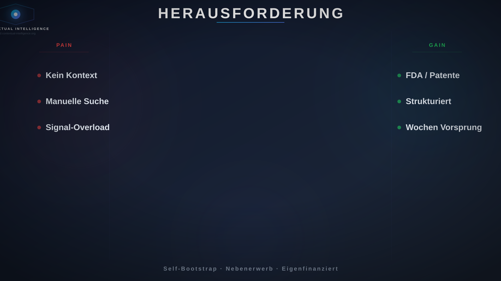
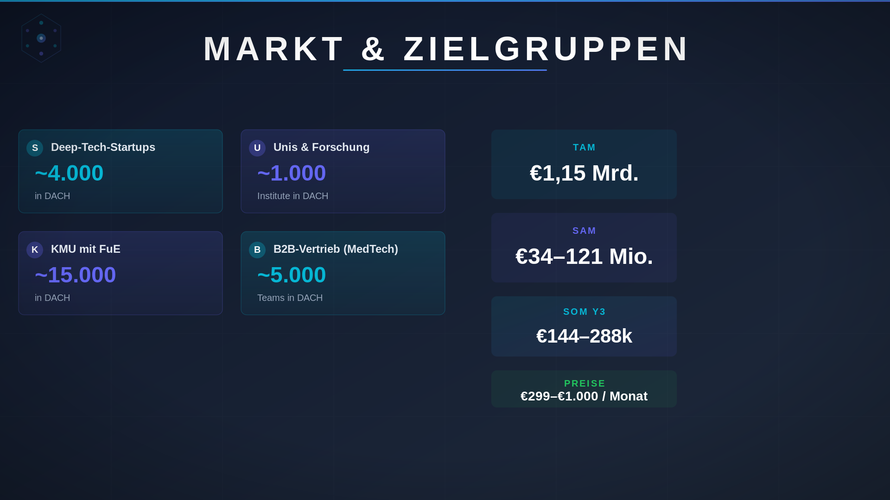
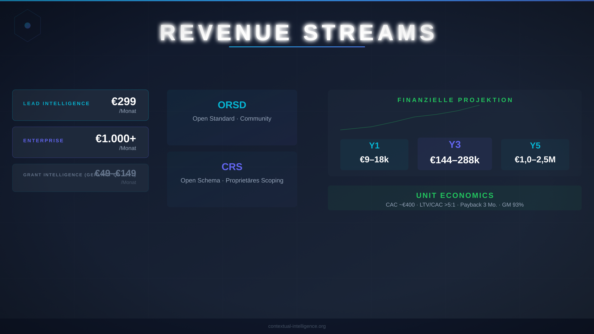
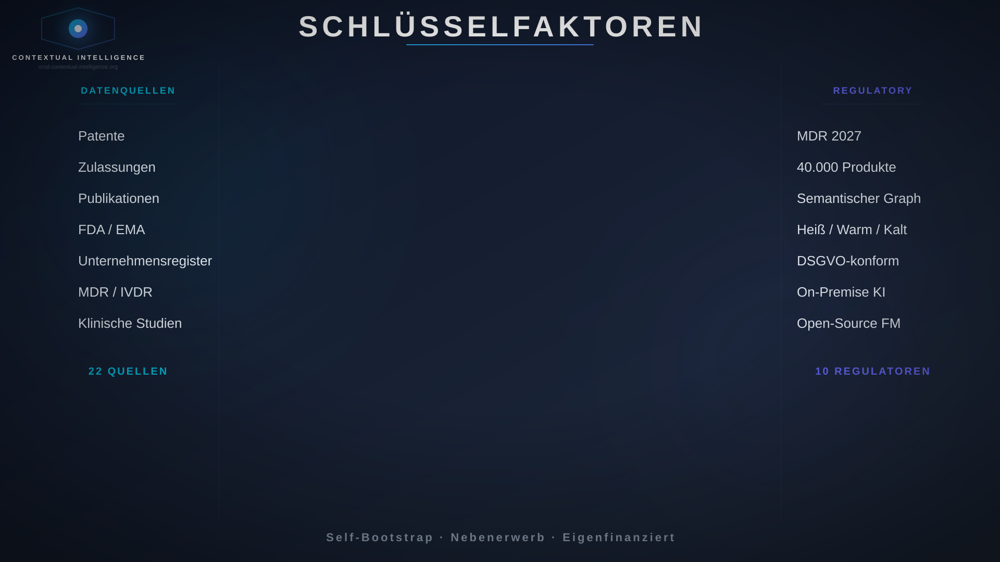
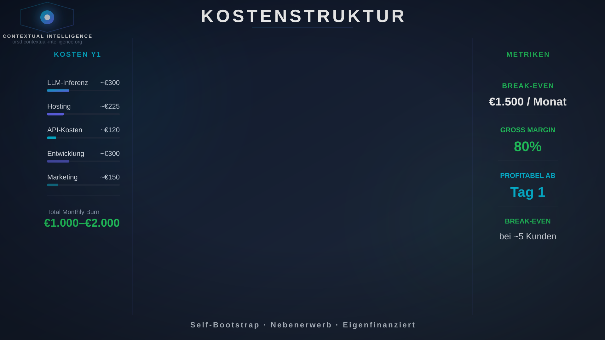
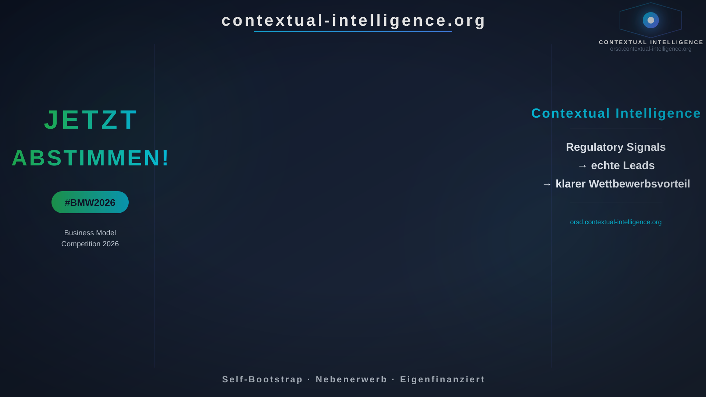

# Pitch-Skript — Business Model Wettbewerb 2026

### Szenen-Übersicht

| Szene | Zeit | Sprecher | SVG |
|-------|------|----------|-----|
| 1 Herausforderung | 0:00–0:25 | Tobias | `bg-01-problem.png` |
| 2 Team & Markt | 0:25–0:48 | Tobias | `bg-02-markt.png` |
| 3 Geschäftsmodell | 0:48–1:05 | Tobias | `bg-03-revenue.png` |
| 4 Schlüsselfaktoren | 1:05–1:28 | Marc | `bg-04-schluesselfaktoren.png` |
| 5 Kosten | 1:28–1:45 | Marc | `bg-05-kosten.png` |
| 6 CTA | 1:45–2:15 | Marc | `bg-06-cta.png` |

---

## SKRIPT

---

## SZENE 1 — HERAUSFORDERUNG (0:00–0:25) → Tobias · `bg-01-problem.png`

Für unsere Lösung nutzen wir souveräne lokale Ki um  Datenquellen automatisiert einzulesen, wie zum Beispiel Patente und Zulassungen.
Einige Datenquellen benötigen Registrierungen und Nutzungslizenzen.
Unser Scoring- und Ratingalgorithmus ist das Herzstück der Lösung und klassifiziert die Leads in drei einfache Kategorien.

---

## SZENE 2 — TEAM & MARKT (0:25–0:48) → Tobias · `bg-02-markt.png`

*[Tobias bleibt im Bild]*

-----

Die Kosten für unsere Lösung kommen zustande durch das Server und Ki-Hosting, Api Lizenzgebühren und Marketing.
Diese belaufen sich auf ein bis zweitausend euro pro Monat.
Durch unsere Nebenerwerbsgründung und Eigenfinanzierung ist Contextual Intelligence bereits mit dem ersten Kunden kostendeckend.

---

## SZENE 3 — GESCHÄFTSMODELL (0:48–1:05) → Tobias · `bg-03-revenue.png`

Du glaubst unser Ki-gestütztes Produkt, das seine eigenen Leads generieren kann, ist bereit für die Zukunft?
Wir bitten um deine Stimme beim StartMiUp Business Modell Wettbewerb 20 26. 
Regulatorische Signale, echte Leads - ein klarer Wettbewerbsvorteil.
Das ist Contextual Intelligence.

---

## SZENE 4 — SCHLÜSSELFAKTOREN (1:05–1:28) → Marc · `bg-04-schluesselfaktoren.png`

*[Marc im Bild]*

-----

„Stellen Sie sich vor: Täglich neue Patente, Studien, und Zulassungen. Alles im Wandel. Nichts sicher. In dieser Unsicherheit entscheiden Sie über Ihre Zukunft. Worauf setzen Sie?"  „MedTech Marketing wird komplexer — 
Die EU Medizinprodukteverordnung 2027, tägliche neue Konferenzbeiträge und Stellenausschreibungen. Contextual Intelligence gibt Ihnen Klarheit. Tagesaktuelle Datenquellen, ein semantischer Graph — Klare Kategorie: kalt, warm, heiß. 
---

## SZENE 5 — KOSTEN (1:28–1:45) → Marc · `bg-05-kosten.png`

„Ich bin Tobias, Marc und ich verwirklichen gemeinsam die Contextual Intelligence Vision. Siemens Healthineers haben beim StartMiUp Hack-a-thon den Bedarf klar formuliert — die Unsicherheit bei der Suche von Leads. Deshalb Unser Fokus: Zulassungen, Patente und Publikationen. Wir tragen zur allgemeinen open-source Bewegung bei: Unser Datensatz für regulatorische Signale ist öffentlich zugänglich - interessant für Forschungs-, und insbesondere MedTech Unternehmen.

---

## SZENE 6 — CTA (1:45–2:15) → Marc · `bg-06-cta.png`

Slide 6:
Nun zur Go-to-Market Strategie: Siemens Healthineers als Referenzkunde — einer erster Proof-of-concept, dass es funktioniert.
Wir liefern KI-gestütze Lösungen für echten Pain des Kunden. Direkt am Problem. Projektbasiert, individuell — Auf Anfrage.
Ein besonderes Merkmal unseres Geschäftsmodells ist unser Self-Bootstrapping: Wir nutzen unser Tool für die Identifizierung eigener Leads. Das Produkt generiert sein Wachstum selbst.
---

---

**Puffer: 2:15–3:00** — Atem holen, Lächeln, Blick halten.
